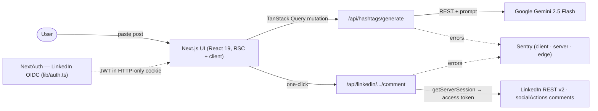
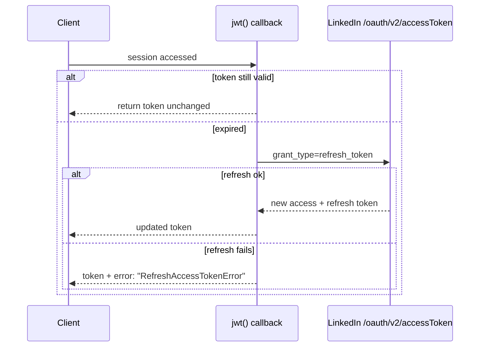

# LinkedIn Hashtag Refresh Engine

Paste a LinkedIn post, get three strategy-specific hashtag sets from Gemini, sign in, and add your pick as a comment in one click — a second push for something you already wrote. The interesting part isn't the AI; it's the plumbing around a third-party API that expires tokens every 60 days and only lets you write.

**[Live](https://ai-linkedin-hashtag-refresh-engine-app.vercel.app)** · Next.js 15 · NextAuth (LinkedIn OIDC) · Google Gemini · TypeScript

---

## Contents

1. [What it does](#what-it-does)
2. [Architecture](#architecture)
3. [Authentication & the 60-day token](#authentication--the-60-day-token)
4. [Hashtag generation](#hashtag-generation)
5. [Posting the comment](#posting-the-comment)
6. [API surface & error model](#api-surface--error-model)
7. [Observability & delivery](#observability--delivery)
8. [The scraping decision](#the-scraping-decision)
9. [Project structure](#project-structure)
10. [Run it locally](#run-it-locally)
11. [Tests & honest limitations](#tests--honest-limitations)
12. [Tech stack](#tech-stack)

---

## What it does

A LinkedIn post stops circulating once its hashtags go stale. This refreshes them:

1. Paste the post text. Gemini drafts **three batches of 12 hashtags**, each tuned for a different goal — *Maximum Reach*, *Viral Potential*, *Engagement Focus*.
2. Sign in with LinkedIn (OpenID Connect).
3. One click posts your chosen set **as a comment on that post**, using the `w_member_social` write scope.

No database. The app holds nothing between requests except an encrypted session cookie — everything else is the LinkedIn and Gemini APIs.

---

## Architecture

A Next.js App Router app on Vercel. The UI is React; the "backend" is a handful of serverless route handlers. Two external systems do the real work — Gemini generates, LinkedIn stores — and this app is the typed, authenticated glue between them.



**Layers**

- **`lib/auth.ts`** — NextAuth config: the OIDC provider, the JWT/session callbacks, and the hand-rolled token refresh (below).
- **`lib/api/gemini.ts`** — the prompt, the call, and the parser/validator that turns model text into clean hashtag batches.
- **`lib/api/linkedin-internal-api.ts`** — the LinkedIn REST client that posts the comment.
- **`app/api/*`** — thin route handlers: validate input with Zod, call the library, return one typed envelope.
- **State on the client** is split three ways: TanStack Query (server data), Zustand (UI/user), React Hook Form + Zod (forms).

There is no server-side state store. Sessions are stateless JWTs, so the app scales horizontally with zero coordination — and also means there's no post/hashtag history (a deliberate MVP cut, not an oversight).

---

## Authentication & the 60-day token

This is the part that actually took the work. LinkedIn's OAuth is OpenID Connect, its access tokens expire after **60 days**, and its ID-token JWKS doesn't validate cleanly through NextAuth — so the provider is configured to verify only the `state` parameter (CSRF) and map the profile by hand (`lib/auth.ts`).

Tokens are kept in an encrypted, HTTP-only JWT cookie (no database session). The **refresh is hand-rolled** in the NextAuth `jwt` callback:



The failure branch matters: instead of throwing, a failed refresh **flags the token** with `error: 'RefreshAccessTokenError'`. The `session` callback surfaces that flag to the client, which treats it as "re-authenticate" rather than silently handing a dead token to the LinkedIn API and failing mid-post. Scopes requested: `openid profile email w_member_social`.

---

## Hashtag generation

`lib/api/gemini.ts` calls the Gemini `generateContent` REST endpoint directly (no SDK). The prompt asks for **exactly three batches of twelve** and pins the output to a JSON shape. Because a model won't always honor that, the response goes through two guards before it reaches the UI:

- **`parseBatches`** — pulls the first `{…}` block out of the model text (with an array-format fallback), so a stray sentence around the JSON doesn't break parsing. If nothing parses, it throws a typed error rather than returning garbage.
- **`validateHashtags`** — strips a leading `#`, enforces 3–30 characters and an alphanumeric/underscore charset, drops a spam-keyword blocklist (`like4like`, `f4f`, `followback`, …), lowercases, and caps each batch at 12.

So the model does the creative part; deterministic code decides what's actually allowed through.

---

## Posting the comment

LinkedIn's `w_member_social` scope is **write-only** — you can create a comment, but you can't read or delete one. `lib/api/linkedin-internal-api.ts`:

1. Extracts the numeric activity id from the pasted post URL (`/activity[:-](\d+)/`) and builds `urn:li:activity:{id}`.
2. Resolves the signed-in member's person URN.
3. `POST`s to `/v2/socialActions/{activityUrn}/comments` with a `Bearer` token and an `actor` of `urn:li:person:{id}`.

The access token comes from `getServerSession` on the server — it's never exposed to the browser. When the API rejects a request, LinkedIn's own `429` is mapped to a "wait 15 minutes" message rather than a raw error.

---

## API surface & error model

Every route returns the **same envelope** (`types/api.ts`), so the client has one shape to handle:

```ts
interface APIResponse<T> {
  success: boolean
  data?: T
  error?: { code: string; message: string; details?: Record<string, unknown> }
  message?: string
}
```

| Method | Route | Purpose | Auth |
|---|---|---|---|
| `GET`  | `/api/health` | Liveness (status, uptime) — used by the Docker healthcheck | — |
| `GET/POST` | `/api/auth/[...nextauth]` | NextAuth (LinkedIn OIDC) | — |
| `GET`  | `/api/auth/me` | Current session user | cookie |
| `POST` | `/api/hashtags/generate` | Generate the three batches | — |
| `POST` | `/api/linkedin/posts/{postId}/comment` | Post hashtags as a comment | cookie |

Input is validated with **Zod at the boundary** — `content` must be ≥ 10 chars, the comment route takes 1–15 hashtags — and a `ZodError` becomes a `400 VALIDATION_ERROR` with the issues in `error.details`. Other failures map to intent-revealing codes (`CONFIG_ERROR`, `GENERATION_FAILED`, `UNAUTHORIZED`, `RATE_LIMIT_EXCEEDED`, `INTERNAL_ERROR`) rather than leaking stack traces.

---

## Observability & delivery

- **Sentry across all three runtimes** — `sentry.client.config.ts`, `sentry.server.config.ts`, `sentry.edge.config.ts`, plus `instrumentation.ts`, wired through `withSentryConfig` with a `/monitoring` tunnel route so ad-blockers don't drop client errors.
- **Container** — a multi-stage Dockerfile (`deps → builder → runner`) on `node:20-slim`, Next.js `output: "standalone"`, running as a **non-root user** (`nextjs`, uid 1001), with a `HEALTHCHECK` that hits `/api/health`. Portable to Cloud Run / ECS; the live app runs on Vercel.
- No CI workflow is committed — Vercel builds on push.

---

## The scraping decision

The original plan was to fetch a post's text automatically by scraping it with Puppeteer. On Vercel's serverless runtime that proved a dead end, and rather than pay for a scraping API I **dropped auto-fetch for manual paste** — the user pastes the post text, which is one extra step and zero moving parts that break.

The scars are still in the tree, honestly: the Dockerfile installs Chromium "for Puppeteer support," `next.config.ts` keeps a `puppeteer-core` webpack external, and `fetchLinkedInPostContent()` is a stub that throws *"paste post content manually."* Left as-is so the decision is legible; the cleanup is noted below.

---

## Project structure

```
app/
  (public)/ (dashboard)/   route groups: marketing vs. authenticated
  api/
    auth/[...nextauth]/    NextAuth handler
    hashtags/generate/     Gemini generation
    linkedin/.../comment/  post a comment
    health/                liveness
lib/
  auth.ts                  NextAuth + hand-rolled token refresh
  api/gemini.ts            prompt, call, parse, validate
  api/linkedin-internal-api.ts   LinkedIn REST client
  validations/             Zod schemas
  hooks/                   TanStack Query hooks
types/api.ts               the shared response envelope
sentry.*.config.ts         client / server / edge
Dockerfile                 multi-stage, non-root, healthcheck
```

---

## Run it locally

```bash
npm install
cp .env.example .env.local     # fill in the three required values below
npm run dev                    # http://localhost:3000
```

Required env:

```bash
LINKEDIN_CLIENT_ID=…           # linkedin.com/developers
LINKEDIN_CLIENT_SECRET=…
NEXTAUTH_URL=http://localhost:3000
NEXTAUTH_SECRET=…              # openssl rand -base64 32
GEMINI_API_KEY=…               # makersuite.google.com/app/apikey
```

Sentry (`SENTRY_DSN`) and analytics are optional. `.env.local` is git-ignored — the Gemini key is read server-side only.

---

## Tests & honest limitations

**No automated tests yet.** For a portfolio build I prioritised a working end-to-end flow; if I took it further, the first coverage I'd add is unit tests around `parseBatches`/`validateHashtags` (pure functions with clear edge cases — malformed model JSON, spam filtering, the 12-cap) and the token-refresh branch, since those are the parts most likely to break silently.

Other known trade-offs:

- **No app-level rate limiting.** Generation is currently open; a real deployment needs a per-user limiter in front of the Gemini call.
- **Stateless by design** — no post/hashtag history, because there's no database.
- **Leftover Puppeteer plumbing** in the Dockerfile and webpack config from the abandoned scraper (see above) — dead weight to remove.
- **Write-only LinkedIn scope** — the app can post a comment but can't confirm or delete it afterward.

---

## Tech stack

**Framework** Next.js 15 (App Router) · React 19 · TypeScript
**Auth** NextAuth v4 — LinkedIn OpenID Connect, stateless JWT
**AI** Google Gemini 2.5 Flash (REST, schema-shaped prompt)
**Validation** Zod at every route boundary
**State** TanStack Query · Zustand · React Hook Form
**UI** Tailwind CSS v4 · Radix / shadcn
**Ops** Sentry (client/server/edge) · multi-stage non-root Docker · Vercel
