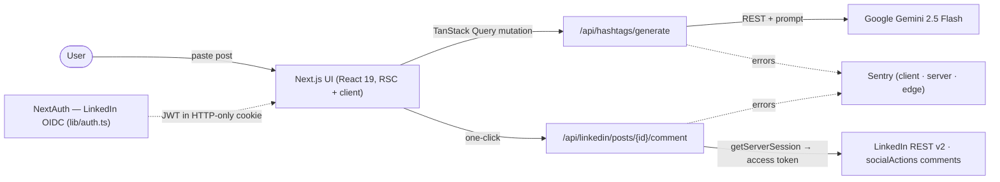
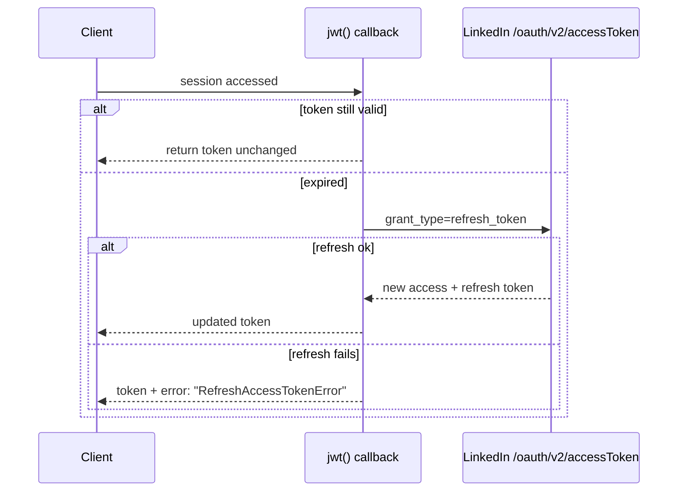

# LinkedIn Hashtag Refresh Engine

Paste a LinkedIn post, get three strategy-specific hashtag sets from Gemini, sign in, and add your pick as a comment in one click — a second push for something you already wrote. The interesting part isn't the AI; it's the plumbing around a third-party API that expires its tokens every 60 days, only lets you write, and returns model text that won't always be the JSON you asked for.

**[Live](https://ai-linkedin-hashtag-refresh-engine-app.vercel.app)** · Next.js 15 · NextAuth (LinkedIn OIDC) · Google Gemini · TypeScript

---

## Contents

1. [What it does](#what-it-does)
2. [Architecture](#architecture)
3. [Where things live](#where-things-live)
4. [Authentication & the 60-day token](#authentication--the-60-day-token)
5. [Hashtag generation](#hashtag-generation)
6. [Posting the comment](#posting-the-comment)
7. [Invariants](#invariants)
8. [Design decisions (and the alternatives I turned down)](#design-decisions-and-the-alternatives-i-turned-down)
9. [API surface & error model](#api-surface--error-model)
10. [Observability & delivery](#observability--delivery)
11. [Run it locally](#run-it-locally)
12. [Tests & known limitations](#tests--known-limitations)
13. [Tech stack](#tech-stack)

---

## What it does

A LinkedIn post stops circulating once its hashtags go stale. This refreshes them:

1. Paste the post text. Gemini drafts **three batches of 12 hashtags**, each tuned for a different goal — *Maximum Reach*, *Viral Potential*, *Engagement Focus*.
2. Sign in with LinkedIn (OpenID Connect).
3. One click posts your chosen set **as a comment on that post**, using the `w_member_social` write scope.

No database. The app holds nothing between requests except an encrypted session cookie — everything else is the LinkedIn and Gemini APIs.

---

## Architecture

A Next.js App Router app on Vercel. The UI is React; the "backend" is a handful of serverless route handlers. Two external systems do the real work — Gemini generates, LinkedIn stores — and this app is the typed, authenticated glue between them.



There is no server-side state store. Sessions are stateless JWTs, so the app scales horizontally with zero coordination — which also means there's no post/hashtag history (a deliberate MVP cut, not an oversight). State on the client is split three ways: TanStack Query (server data), Zustand (UI/user), React Hook Form + Zod (forms).

---

## Where things live

The route handlers are deliberately thin — validate input, call one library function, return one typed envelope. Almost all the logic that matters lives under `lib/`.

```
app/
  (public)/ (dashboard)/           route groups: marketing vs. authenticated
  api/
    auth/[...nextauth]/route.ts    NextAuth handler (LinkedIn OIDC)
    auth/me/route.ts               current session user (or {user:null})
    hashtags/generate/route.ts     Zod-validate → Gemini → envelope
    linkedin/posts/[postId]/comment/route.ts   authed comment; maps LinkedIn errors → codes
    health/route.ts                liveness (status, uptime) for the Docker healthcheck
lib/
  auth.ts                          NextAuth config + the hand-rolled 60-day token refresh
  api/gemini.ts                    the prompt, the call, parseBatches(), validateHashtags()
  api/linkedin.ts                  LinkedIn client the route calls (postHashtagComment)
  api/linkedin-internal-api.ts     socialActions comment POST + person-URN resolution
  config.ts                        env + Gemini model, hashtag caps
  validations/                     Zod schemas
  hooks/                           TanStack Query hooks
types/api.ts                       the shared APIResponse<T> envelope
sentry.{client,server,edge}.config.ts   one Sentry init per runtime
instrumentation.ts  next.config.ts  Sentry wiring; puppeteer-core webpack external (see below)
Dockerfile                         multi-stage, non-root, healthcheck
```

If you only read two files, read **`lib/auth.ts`** (the token lifecycle and the refresh-error flag) and **`lib/api/gemini.ts`** (the prompt plus the two guards that turn model text into a safe hashtag list). Everything else is wiring around those two.

---

## Authentication & the 60-day token

This is the part that actually took the work. LinkedIn's OAuth is OpenID Connect, its access tokens expire after **60 days**, and its ID-token JWKS doesn't validate cleanly through NextAuth — so the provider is configured to verify only the `state` parameter (CSRF) and map the profile by hand (`lib/auth.ts`, `checks: ['state']`).

Tokens live in an encrypted, HTTP-only JWT cookie (no database session). The **refresh is hand-rolled** in the NextAuth `jwt` callback: it checks `accessTokenExpires` on every session access and only calls LinkedIn's token endpoint once the token is actually expired.



The failure branch is the point. Instead of throwing, a failed refresh **flags the token** with `error: 'RefreshAccessTokenError'`. The `session` callback surfaces that flag to the client, which treats it as "re-authenticate" rather than silently handing a dead token to the LinkedIn API and failing mid-post. Scopes requested: `openid profile email w_member_social`.

---

## Hashtag generation

`lib/api/gemini.ts` calls the Gemini `generateContent` REST endpoint directly (no SDK), on `gemini-2.5-flash`. The prompt asks for **exactly three batches of twelve** and pins the output to a JSON shape. Because a model won't reliably honor that, the response goes through two guards before it reaches the UI:

- **`parseBatches`** — pulls the first `{…}` block out of the model text (with an array-format fallback for the legacy shape), so a stray sentence around the JSON doesn't break parsing. If nothing parses, it throws a typed error rather than returning garbage.
- **`validateHashtags`** — strips a leading `#`, enforces 3–30 characters, requires at least one letter, restricts the charset to `[a-zA-Z0-9_]`, drops a spam-keyword blocklist (`like4like`, `f4f`, `l4l`, `followback`, …), lowercases, and caps each batch at 12.

So the model does the creative part; deterministic code decides what's actually allowed through. Whatever the prompt does or doesn't return, the UI only ever sees clean, capped, in-charset tags.

---

## Posting the comment

LinkedIn's `w_member_social` scope is **write-only** — you can create a comment, but you can't read or delete one (reading posts needs `r_member_social`, a restricted partner permission this app doesn't have). The comment path:

1. Extracts the numeric activity id from the pasted post URL (`/activity[:-](\d+)/`) and builds `urn:li:activity:{id}`.
2. Resolves the signed-in member's person URN from `/v2/userinfo`.
3. `POST`s to `/v2/socialActions/{activityUrn}/comments` with a `Bearer` token and an `actor` of `urn:li:person:{id}`.

The access token comes from `getServerSession` on the server — it's never exposed to the browser. When LinkedIn rejects the request, its status is mapped to an intent-revealing code (below) rather than a raw error: a `429` becomes "wait 15 minutes," a `403` becomes "you can only comment on posts you created or reposted."

---

## Invariants

These hold no matter what the model returns or how LinkedIn responds:

| Invariant | Enforced by |
|---|---|
| A failed token refresh **never** hands a dead token to the LinkedIn API — it surfaces re-authentication instead | `refreshAccessToken` returns `error: 'RefreshAccessTokenError'`; the `session` callback propagates it to the client |
| Every route returns the **same** `APIResponse<T>` envelope — one shape the client always parses | `types/api.ts`; each handler returns `{ success, data?, error?, message? }` |
| Hashtags reaching the UI are always **3–30 chars, `[a-zA-Z0-9_]`, spam-filtered, and capped at 12** per batch | `validateHashtags` runs inside `parseBatches`, before the response is built |
| Malformed model output **fails loud**, never silent — an unparseable response throws a typed error, not a partial/garbage list | `parseBatches` throws `'Invalid batch format in response'` when no `{…}`/`[…]` block parses |
| The LinkedIn access token is **server-only** — it's written to the JWT and read via `getServerSession`, never sent to the browser | `/api/auth/me` returns the user minus the token; `session.accessToken` is used only in server route handlers |

---

## Design decisions (and the alternatives I turned down)

- **Hand-rolled OIDC refresh with an error flag, not NextAuth's default token handling.** LinkedIn's JWKS doesn't validate through NextAuth, and the default path can quietly return an expired token. I verify only `state`, map the profile by hand, and make a failed refresh set `error: 'RefreshAccessTokenError'` so the app forces re-auth instead of failing mid-post against LinkedIn. More code, but the failure is legible and lands in the right place.
- **One typed error envelope, not ad-hoc per-route shapes.** Every handler returns the same `APIResponse<T>`, and failures carry an intent-revealing `code` (`VALIDATION_ERROR`, `CONFIG_ERROR`, `GENERATION_FAILED`, `UNAUTHORIZED`, `RATE_LIMIT_EXCEEDED`, `POST_PERMISSION_DENIED`, …) rather than a leaked stack trace. The client has one branch to handle, not one per endpoint.
- **Manual paste, not scraping.** The original plan fetched a post's text with Puppeteer; on Vercel's serverless runtime that was a dead end. Rather than pay for a scraping API, I dropped auto-fetch — pasting is one extra step and zero moving parts that break. The scars are still in the tree, on purpose: the Dockerfile installs Chromium "for Puppeteer support," `next.config.ts` keeps a `puppeteer-core` webpack external, and `fetchLinkedInPostContent()` is a stub that throws *"Post content extraction not implemented. Please paste post content manually."* Left legible; the cleanup is noted below.
- **Stateless JWT, no database.** The alternative was a DB with post/hashtag history and saved sets. For an MVP that's a working end-to-end flow's worth of infrastructure I didn't need — a stateless JWT scales horizontally with zero coordination. The cost is honest: no history. A deliberate cut, revisited only if the product needs it.

---

## API surface & error model

Every route returns the same envelope (`types/api.ts`), so the client has one shape to handle:

```ts
interface APIResponse<T> {
  success: boolean
  data?: T
  error?: { code: string; message: string; details?: Record<string, unknown> }
  message?: string
}
```

| Method | Route | Purpose | Auth |
|---|---|---|---|
| `GET`  | `/api/health` | Liveness (status, uptime) — used by the Docker healthcheck | — |
| `GET/POST` | `/api/auth/[...nextauth]` | NextAuth (LinkedIn OIDC) | — |
| `GET`  | `/api/auth/me` | Current session user (`{user:null}` if signed out) | cookie |
| `POST` | `/api/hashtags/generate` | Generate the three batches | — |
| `POST` | `/api/linkedin/posts/{postId}/comment` | Post hashtags as a comment | cookie |

Input is validated with **Zod at the boundary** — `content` must be ≥ 10 chars, the comment route takes 1–15 hashtags — and a validation failure becomes a `400` with the issues in `error.details`. On the comment route, LinkedIn's own status codes are re-mapped: `401` → `LINKEDIN_AUTH_FAILED`, `403` → `POST_PERMISSION_DENIED`, `404` → `POST_NOT_FOUND`, `429` → `RATE_LIMIT_EXCEEDED` ("wait 15 minutes").

---

## Observability & delivery

- **Sentry across all three runtimes** — `sentry.client.config.ts`, `sentry.server.config.ts`, `sentry.edge.config.ts`, plus `instrumentation.ts`, wired through `withSentryConfig` with a `/monitoring` tunnel route so ad-blockers don't drop client errors.
- **Container** — a multi-stage Dockerfile (`deps → builder → runner`) on `node:20-slim`, Next.js `output: "standalone"`, running as a **non-root user** (`nextjs`, uid 1001), listening on `PORT` (default 8080) with a `HEALTHCHECK` that hits `/api/health`. Portable to Cloud Run / ECS; the live app runs on Vercel.
- No CI workflow is committed — Vercel builds on push.

---

## Run it locally

Under ten minutes: needs Node and a LinkedIn dev app plus a Gemini key.

```bash
npm install
cp .env.example .env.local     # fill in the values below
npm run dev                    # http://localhost:3000
```

Required env:

```bash
LINKEDIN_CLIENT_ID=…           # linkedin.com/developers
LINKEDIN_CLIENT_SECRET=…
NEXTAUTH_URL=http://localhost:3000
NEXTAUTH_SECRET=…              # openssl rand -base64 32
GEMINI_API_KEY=…               # makersuite.google.com/app/apikey
```

Sentry (`SENTRY_DSN`) and analytics are optional. `.env.local` is git-ignored; the Gemini key is read server-side only. In the LinkedIn app, request the *Sign In with LinkedIn* and *Share on LinkedIn* products and add `http://localhost:3000/api/auth/callback/linkedin` as a redirect URL.

---

## Tests & known limitations

**No automated tests yet.** For a portfolio build I prioritised a working end-to-end flow. The first coverage I'd add, in order: unit tests around `parseBatches`/`validateHashtags` (pure functions with clear edge cases — malformed model JSON, the array fallback, spam filtering, the 12-cap), then the token-refresh branch, since those are the parts most likely to break silently.

Other honest trade-offs:

- **No app-level rate limiting.** Generation is open; a real deployment needs a per-user limiter in front of the Gemini call.
- **Stateless by design** — no post/hashtag history, because there's no database.
- **Leftover Puppeteer plumbing** in the Dockerfile and `next.config.ts` from the abandoned scraper (see [design decisions](#design-decisions-and-the-alternatives-i-turned-down)) — dead weight to remove.
- **Write-only LinkedIn scope** — the app can post a comment but can't confirm, read, or delete it afterward.

---

## Tech stack

**Framework** Next.js 15 (App Router) · React 19 · TypeScript
**Auth** NextAuth v4 — LinkedIn OpenID Connect, stateless JWT
**AI** Google Gemini 2.5 Flash (REST, schema-shaped prompt)
**Validation** Zod at every route boundary
**State** TanStack Query · Zustand · React Hook Form
**UI** Tailwind CSS v4 · Radix / shadcn
**Ops** Sentry (client/server/edge) · multi-stage non-root Docker · Vercel
